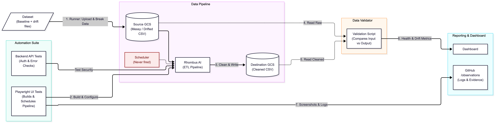

# Rhombus AI: ETL pipeline under drift

Testing Rhombus AI the way a customer uses it: an AI-built pipeline that cleans a messy orders file from cloud storage and delivers it to Google Cloud Storage, followed by deliberate changes to the input to see how the platform, its logs and its AI chatbot respond. Eight cases were run: a baseline, four schema changes (column dropped, renamed, retyped and added) and all four combined, and two semantic changes (dollars written as cents, and day/month swapped). Every output was checked by an independent validator against the known correct answer and every result was cross-checked against Rhombus's own logs and the storage bucket.

**What works:** the cleaning code Rhombus generates from a plain-language brief is accurate, cleaning all 470 baseline orders correctly across eight rules and the same input always produces the same output. When a required column goes missing, the pipeline stops instead of writing bad data. The backend API refuses every request without a valid login or for another customer's project.

**What doesn't:** every other change passes silently. Retyped dates came out entirely blank, a new column was dropped, amounts arrived too high and dates changed meaning, all reported as "completed successfully". The chatbot six times reported fixes that never reached the code that runs (its edits changed the instructions, not the code), applied changes without asking, and offers no undo. And the pipeline can't run unattended on changing data: schedules showed "Active" but never ran, a changed source file is ignored until it's manually reconnected, and each reconnect starts runs nobody asked for.

**Live dashboard: [rhombusai.netlify.app](https://rhombusai.netlify.app/)**: pipeline health, output consistency, capability heat map, time and resources, test videos and walkthroughs.

## Architecture



*Results are reported in [`observations/`](observations/) and on the [observability dashboard](#observability-dashboard-bonus).*

1. The **runner** loads a test file into the source bucket and records exactly which version (MD5 and GCS generation).
2. The pipeline runs in Rhombus. The runner captures only an output created **after** the trigger, so automatic runs can't be mistaken for the test run.
3. The **validator** checks the output independently of Rhombus, against the known correct answer.
4. Every result was **cross-checked** against Rhombus's own notification log and the bucket listing. This found and corrected one mis-recorded run (case 07, run 1).

## Demo videos

| | Video | Shows |
|---|---|---|
| ▶ | **[UI tests walkthrough](https://storage.googleapis.com/rhombus-test-videos/ui-test-video.mp4)** | The Playwright journey: source connection, AI-built pipeline, a manual run that lands a cleaned file in GCS, the destination, the schedule, and the known issues confirmed |
| ▶ | **[API tests walkthrough](https://storage.googleapis.com/rhombus-test-videos/api-test-video.mp4)** | The API tests against the live backend: positive checks, the six security (negative) tests, and the three known issues confirmed through the API |

The videos open in the browser. Recordings of each individual UI test also play in the dashboard's [Test videos](https://rhombusai.netlify.app/) tab; the files are in [`ui-tests/videos/`](ui-tests/videos/).

---

## Contents

1. [Setup and how to run](#1-setup-and-how-to-run)
2. [Observations summary](#2-observations-summary)
3. [Usability feedback](#3-usability-feedback)
4. [Demo video](#4-demo-video)
5. [Method and trade-offs](#method-and-trade-offs)
6. [Limitations](#limitations)

---

## 1. Setup and how to run

### Prerequisites

- **Google Cloud CLI** (`gcloud`), logged in to the project that holds the buckets
- **Python 3.11+** (standard library only)
- **Node.js 20+**

```bash
gcloud auth login
gcloud config set project <your-project-id>
```

Buckets used: `rhombus-source` (input), `rhombus-target` (Rhombus output), `rhombus-runs` (run-log backup). The Rhombus pipeline is Data Input → Custom (AI cleaning step) → Data Output to `rhombus-target`.

### Repository layout

| Folder | Contents |
|---|---|
| [`datasets/`](datasets/) | Baseline file, 7 drifted versions, the correct cleaned answer, answer key, generator |
| [`runner/`](runner/) | Loads a case into GCS, waits for the Rhombus output, saves and logs every run |
| [`data-validation/`](data-validation/) | Compares each output with its input and the correct answer |
| [`ui-tests/`](ui-tests/) | Playwright tests of the pipeline journey in the web app |
| [`api-tests/`](api-tests/) | Tests that call the Rhombus backend directly |
| [`observations/`](observations/) | One file per case, the chatbot evaluation, all findings, and evidence |
| `outputs/`, `results/` | Every Rhombus output and run record |
| [`dashboard/`](dashboard/) | Observability dashboard : a single page built from the run and validation records |
| `docs/` | Architecture diagram |

### Datasets

Already generated. To regenerate them identically (fixed seed):

```bash
python3 datasets/generate_test_data.py
```

### Run a test case

```bash
python3 runner/run_cases.py --cases 03-schema-type-change
```

The runner uploads `datasets/<case>.csv` to `gs://rhombus-source/input/` (skipping the upload if it's already there), then pauses. Press Enter, then select the dataset in the Rhombus Data Input node, which starts the run. The runner waits for a **new** output in `rhombus-target`, saves it as `outputs/<case>__run<N>.csv`, and records the run in `results/runs.csv`, whatever the outcome. If Rhombus fails, it asks for the error message and records it.

```bash
python3 runner/status.py          # where every case stands, and what to do next
```

### Data validation

```bash
python3 data-validation/validate.py --all              # every case and run
python3 data-validation/validate.py 06-semantic-cents  # one case
```

Checks schema, row counts, correctness against the known right answer, the original cleaning rules, blank rates, semantic ranges (amounts and dates), determinism across runs, and stale-input detection. Runs that produced no output are recorded as **STOPPED** with their Rhombus error. Results: `results/validation/`.

### UI tests

```bash
cd ui-tests
npm install && npx playwright install chromium
cp .env.example .env            # set RHOMBUS_PROJECT_URL
npm run auth:chrome             # log in once (see ui-tests/README.md)
npm test
npm run report
```

### API tests

```bash
cd api-tests
cp .env.example .env            # set RHOMBUS_TOKEN (see api-tests/README.md)
npm test
```

No dependencies: Node's built-in test runner and `fetch`.

### Observability dashboard (bonus)

**Live: [rhombusai.netlify.app](https://rhombusai.netlify.app/)**

```bash
python3 dashboard/serve.py        # open locally at http://127.0.0.1:8765/ (uses the stored data.json)
python3 dashboard/build.py        # only after new test runs: regenerate dashboard/data.json
```

The data is stored in [`dashboard/data.json`](dashboard/data.json) and committed with the repo, so the page (locally or hosted) needs no build step.

One self-contained page (`index.html` + `data.json`, no external scripts) with the four views the brief asks for: **pipeline health** by scenario, **output consistency** (the 3-run protocol, with side-by-side diffs where outputs differ), a **capability heat map** (which drift types Rhombus handles, breaks or misses), and **time and resources** per scenario, plus a **Test videos** tab that plays the UI test recordings. `build.py` copies the videos from `ui-tests/videos/` into `dashboard/videos/`, so the whole `dashboard` folder can be hosted as it is.

---

## 2. Observations summary

| Case | Change | Pipeline stopped? | Chatbot fix worked? | Severity |
|---|---|---|---|---|
| [00 Baseline](observations/00-baseline.md) | None | No (correct) | n/a | Low |
| [01 Drop column](observations/01-schema-drop-column.md) | `email` removed | ✅ Yes, but only after a manual reconnect; the first run used **stale data** | ❌ No: reported as applied, never reached the code | **High** |
| [02 Rename column](observations/02-schema-rename-column.md) | `amount_usd` → `total_amount` | ✅ Yes | Not tested | Medium |
| [03 Type change](observations/03-schema-type-change.md) | `order_date` → Unix timestamps | ❌ No: **every date blank**, reported as success | ⚠️ Yes, at the "v6" attempt, after a hint | **High** |
| [04 Add column](observations/04-schema-add-column.md) | `discount_code` added | ❌ No: **column dropped**, no warning | Not tested | Medium |
| [05 Combined](observations/05-schema-combined.md) | All four schema changes | ✅ Yes, on the first problem only | ❌ No: claimed to regenerate the code; it didn't | **High** |
| [06 Cents](observations/06-semantic-cents.md) | Dollars → cents | ❌ No: **amounts 100× too high** | Not tested | **High** |
| [07 Date swap](observations/07-semantic-date-swap.md) | MM/DD → DD/MM | ❌ No: **252 dates wrong** | Not tested | **High** |

**Severity:** High = wrong data delivered without warning, or a fix that claims to work but doesn't. Medium = a visible failure that's hard to diagnose, or data dropped silently while values stay correct. Low = cosmetic.

Automated tests: [UI tests](observations/ui-tests.md) (5 of 8 pass, including a manual run that lands a new cleaned file in GCS) and [API tests](observations/api-tests.md) (all 16 pass, including 6 security tests and 3 known issues confirmed through the API). All 33 findings: [findings log](observations/findings-log.md). Chatbot: [evaluation](observations/chatbot-evaluation.md).

### Top three findings

1. **Most drift passes silently.** Rhombus only stops when the generated code hits a missing column. A type change (03), a new column (04), cents instead of dollars (06) and swapped day/month (07) were all reported as "completed successfully" while delivering blank dates, a dropped column, amounts 100× too high and 252 wrong dates. The independent validator caught all of them, except 44 swapped dates that no output check can detect.

2. **Chatbot fixes change the prompt, not the code that runs.** Six times, the chatbot said a fix was applied or in place while the executed code stayed the same (`code_sha=3ca80b148200`); once it even confirmed this itself. Two saved run logs show different prompts with character-for-character identical code. Fixes are applied without asking, there's no undo, and its proposed fix (fill missing columns with blanks) would have turned visible failures into silent data loss. Only its "v6" attempt, patching the code directly instead of the prompt, reached the running code.

3. **The pipeline can't run unattended on changing data.** Three Active schedules produced none of 74 expected runs, with no alert. Rhombus runs on a snapshot taken when the source syncs, so a changed file is ignored (one run silently re-cleaned old data, including 383 emails that weren't in the input); refreshing needs a manual reconnect, and each reconnect or dataset selection starts 2–4 runs nobody asked for.

---

## 3. Usability feedback

**What worked well.** Turning a plain-language cleaning brief into working code was genuinely impressive: the AI Builder produced a pipeline that cleaned all 470 baseline orders correctly across eight rules, including awkward cases like number words, mixed date formats and country abbreviations, and the same input always gave the same output. The canvas makes the pipeline easy to understand at a glance, error logs are structured JSON with a code version (`code_sha`) that made tracing possible, and the backend API is consistent and properly secured: every request without a valid login, or for another project, was refused without leaking data. The documentation was clear enough to set up connections and schedules exactly as described.

**What was frustrating, and how it could be better.** Most of the time went into working around the platform rather than testing it. The S3 connection rejected a correct, generated policy; schedules showed "Active" but never ran; changed source files were ignored until a manual reconnect (sync limited to every 30 minutes); every reconnect or dataset selection fired several runs; and every dataset in the picker was called `placeholder_file`. The chatbot was the biggest source of confusion: it confidently reported fixes that never reached the running code, applied changes without asking, and offered no way back. Things that would help most: **re-read the source on every run** (or show the snapshot time clearly); **warn on schema and value changes** (new, missing or renamed columns; values far outside their usual range) instead of passing them silently; **show the code diff and ask before applying a chatbot fix, with version history to undo it**; make "success" mean the output is actually written; and record in the logs what triggered each run, which input it read, and which code version ran.

---

## 4. Demo video

- **[UI tests walkthrough](https://storage.googleapis.com/rhombus-test-videos/ui-test-video.mp4)**
- **[API tests walkthrough](https://storage.googleapis.com/rhombus-test-videos/api-test-video.mp4)**

---

## Method and trade-offs

- **GCS source instead of S3.** The S3 connection failed every time with "AWS denied Rhombus AI access to the whole bucket", although the generated policy was applied exactly ([evidence](observations/evidence/s3-connection/)). A support request was sent, and the source switched to GCS so testing could continue. The S3 step is still covered by a UI test written as an expected failure.
- **Manual runs instead of scheduled runs.** No schedule ever ran ([evidence](observations/evidence/scheduler/)), so the "successful scheduled run" baseline is a manual run, repeated 4 times with byte-identical output.
- **One source file per case (from case 03).** Rhombus didn't pick up changes to the same file, and only one bucket can be connected, so each case was uploaded as its own file in `input/` and selected in the Data Input node. The drift is still tested against the same pipeline code.
- **Independent validation with a known right answer.** Every drift case contains the same orders as the baseline, so the correct output is known exactly. That made it possible to count every wrong value, and to show which errors a real-world range check would and wouldn't catch.
- **Security.** Tokens and service-account keys live only in git-ignored `.env` files. For speed, the Rhombus service account was given a broad storage role; in production it would get read-only access to the source and write access to the target.

## Limitations

- **"What happens to the schedule afterwards"** couldn't be tested, because no schedule ever ran.
- **Chatbot** tested on cases 01, 03 and 05 (and the build stage); not on 02, 04, 06 and 07.
- **Case 03 fix:** the code fix is confirmed through the API, but the input preview for the run with correct dates wasn't captured.
- **UI tests:** the S3 test isn't yet confirmed to reach the S3 error; the AI Builder prompt and scheduler-wait tests are opt-in and weren't run. Login is a manual one-off step, because Google blocks sign-in from automated browsers.
- **F30** (output node losing its destination settings) was seen through the API but not confirmed in the UI.
- Some evidence is missing: input previews for cases 03, 04, 06 and 07, and two Rhombus log entries. Listed in [observations](observations/README.md).